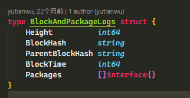
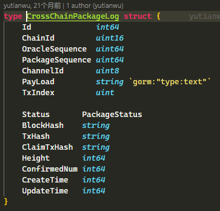
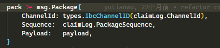
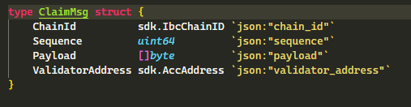

# 预言机 Oracle

## 什么是 `oracle`

> `oracle` 翻译是预言机，英文中的意思是预卜先知，知晓消息的意思。在区块链里用于合约获取链外的数据。

BSC => BC 跨链交易：

## 位于`Beacon Chain` 上的跨链相关模块

​	位于`Beacon Chain`上的`oracle`模块，可类比成以太坊上的合约。

## Oracle 模块

`Oracle 模块` 用于处理 **预言（Prophecy）** 和 **声明（Claim）**，Prophecy 的意思是验证者们需要对某些事情上达成共识（例如跨链交易等）。在跨链交易中，验证者各自提出自己的`claim`，`claim`内容就是跨链交易的明细，（换句话说，就是验证者各自声明自己在`BSC`链上看到了哪些跨链交易）；当大多数验证者（如70%）在`预言`上声明了相同的内容时，获胜的内容将被确认。每种类型的声明都有其序列号，当声明被确认时，序列号就+1。

## Oracle 处理流程

1. **Oracle模块处理**：Oracle模块负责接收验证者提交的声明消息。仅当消息中的序列号与当前期望的序列号匹配时，该消息才会被接受。不匹配的序列号将导致声明消息被立即拒绝，以维护数据的连续性和完整性。
2. **消息有效性验证**：在序列号验证通过后，系统将进一步审查声明消息的内容。任何不符合预定标准的声明将被标记为无效，并且相关消息将被退回。
3. **预言的创建与累积**：对于首次出现的有效声明，系统将初始化一个新的预言实例。若后续收到的声明消息与已存在的预言相关，则这些声明将被累积至该预言中。
4. **共识阈值与执行**：当相同声明内容的验证者权重累计达到70%的共识阈值时，预言状态将更新为成功。随后，系统将执行该声明，并适当增加该类型声明的序列号。
5. **共识失败与重置**：若验证者未能在规定时间内达成共识，预言将被标记为失败，并从系统中移除。此时，验证者需重新提交声明，以便在下一轮中尝试达成共识。

## bridge 模块

桥接模块将处理跨链交易。它包含两部分：从 `BC` 到 `BSC` 的交易和从 `BSC` 到 `BC` 的交易。对于从 `BSC` 到 `BC` 的交易，它将取决于 oracle 模块。当验证者对某个声明达成共识时，桥接模块将根据该声明处理交易，如从 BSC 到 BC 的代币转移。对于从 BC 到 BSC 的交易，它会处理交易的 BC 部分，并为 BSC 编写相关的跨链数据包。

## 中继器

​	中继器`oracle-relayer`是一个独立的二进制程序，它监听 BSC 上的事件，构建事务并将其广播到 BC。每个验证者都应该维护自己的中继器，并且中继器需要能够访问验证者的私钥。所有中继器服务独立见证`BSC`上的跨链合约事件，然后构建交易以向 BC `oracle`模块声明事件。

### 中继过程

1. 持续监听跨链事件：

中继器持续监听BSC链上`CrossChain`合约的事件，将跨链数据保存到数据库

2. 从`BC`链上获取`sequence`等参数

3. 根据`sequence`参数从数据库获取要声明的交易

4. 将数据包放在`claim`消息里，发送给`BC`链中的`oracle`模块：

   声明的内容：
   
   

`claim`消息结构:

