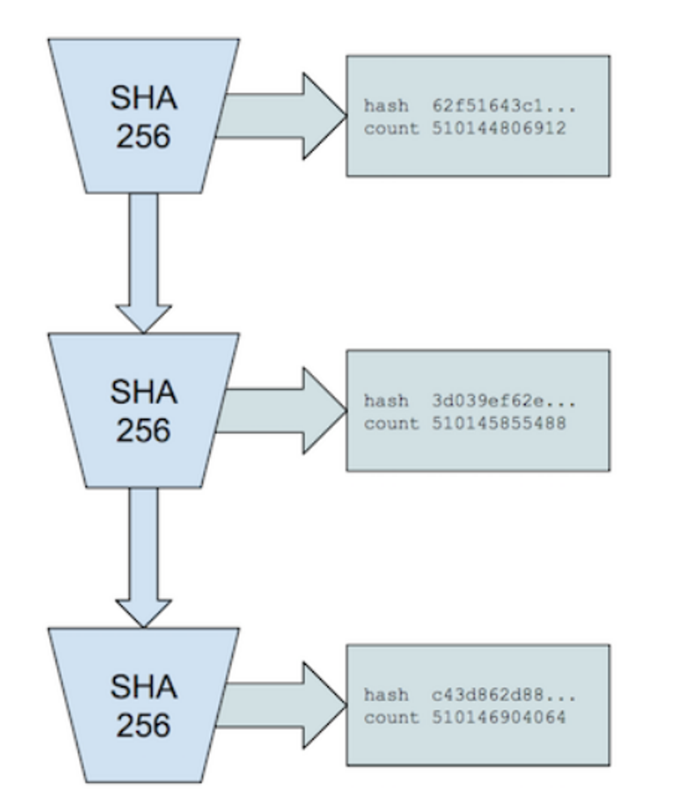

# Gas机制及计算方法

***

> Filecoin的`gas`机制，很大程度参考的是以太坊的[EIP1559](https://github.com/ethereum/EIPs/blob/master/EIPS/eip-1559.md)

## Filecoin Gas 机制概述

Filecoin引入Gas机制的原因是为了调节交易的拥堵情况，优化网络性能，并确保网络的可持续性：

1. **调节交易拥堵**：Filecoin的Gas模型引入了BaseFee，这是一个动态调整的价格，用来反映网络的拥堵程度。当网络拥堵时，BaseFee会上升，这样只有愿意支付更高费用的交易才能被处理，从而减少拥堵。
2. **资源消耗补偿**：执行交易会消耗网络上的计算和存储资源。Gas机制通过衡量消息消耗的资源来确定发送者需要支付的费用，以此来补偿网络的资源消耗。
3. **防止恶意行为**：如果没有合适的费用机制，矿工可能会包含计算上昂贵的消息而不支付相应的费用，导致其他网络参与者承担成本。Gas机制确保发送者支付足够的费用来防止这种情况发生。
4. **网络通缩压力**：通过燃烧部分交易费用，Filecoin网络可以产生缓慢的通缩压力，从而使所有网络参与者受益。

<figure><figcaption><p>gas机制</p></figcaption></figure>

在引入Gas机制之前，矿工通过出块和直接收取交易手续费获得奖励。这就导致网络费用波动太大，有些时空证明消息可能不能及时上链。再就是可能会有恶意的矿工，自己打包自己发出的一笔计算量很大的交易，却没有付出多少手续费。其它节点验证这笔交易却要消耗很大的资源。

引入`EIP1559`后，交易上链时的手续费都需要高过`baseFee` , `baseFee` 会随着上一个区块容量使用比率进行调整，高于50%目标容量时上涨，反之下跌，最大调整幅度不超过1/8。

通过燃烧掉`basefee` 降低了代币流通量，也变相的提高了其它用户手中代币的价值，减少通胀。也可以当作是交易发起者向全网络的节点支付了“费用”。

## gas 分析整理

### 名词解释

* `feeCap`:交易发起者设置的参数，代表本条交易能够接受的`gas`价格的上限。
* `baseFee`:一个`gas`的网络价格，不受人为控制，随区块内交易的拥挤程度波动
* `gasPremium`:每个`gas`的支付给矿工的金额，`gas`的数量为`gasLimit`,`gasPremium`会受到`feeCap`和`baseFee`的影响
* `gasLimit`:  本条交易可以使用的`gas`的数量上限

### 最大消耗费用

也就是执行消息所要消耗的金额的上限，不管是燃烧掉的、还是给矿工的小费，其总和都不会大于此。

$$
\begin{aligned} MaxFee&=gasLimit \cdot feeCap \\ \end{aligned}
$$

### 基础费用

`baseFee`即，每个`gas的单价，随网络波动而波动`

$$
\begin{aligned} baseFeeUsed&=baseFee \cdot gasUsed \\ \end{aligned}
$$

* `baseFee`若超过`feeCap`,交易发起方只需要以`feeCap`大小作为`baseFee`计算，少支付的部分由矿工支付(这相当于惩罚矿工乱打包交易，此外矿工还会受到3倍惩罚)。

$$
baseFeeBurn= \begin{cases} &baseFee \cdot gasUsed &,\text{(当$ baseFee< feeCap $ 时)}\\ &feeCap \cdot gasUsed &,\text{(当$baseFee>=feeCap$时，少燃烧部分由矿工承担)} \end{cases}\\ 超出部分由矿工支付=(basefee-feecap)\cdot gasUsed\\
$$

***

### 矿工小费

`gasPremium`为每用一个gas给矿工的小费，即矿工小费单价

$$
矿工小费= \begin{cases} &gasPremium \cdot gasLimit,\text{(当 baseFee+gasPremium<=feeCap 时)}\\ &(feeCap-baseFee)\cdot gasLimit,\text{(当baseFee +gasPremium>feeCap 时)} \end{cases}
$$

### 当设置的GasLimit过高时

`GasLimit` 用于指示一条交易最多可以消耗多少`gas` 。

因为 `Filecoin` 是在交易打包进区块后，在下一个区块开始前再开始执行交易的。所以打包交易时，并不知道交易的实际 `Gas` 使用量。所以`GasLimit` 由发送方预估并设置。而每个区块的容量是有限的，区块容量使用了多少是通过计算区块内所有交易的`GasLimit` 得出的。

所以为了避免交易设置的`GasLimit` 过高，导致区块内实际有效使用量下降。`Filecoin` 网络将会燃烧掉超出实际使用`gas` 的一部分。

### 超额燃烧的gas数量计算

$$
OverEstimation= \begin{cases} & gasLimit&,&\text{当 gasUsed为0时,}\\ & 0&,&\text{当 $gasLimit< 1.1 \cdot gasUsed $ 时,}\\ & 剩余Gas\times 超出率&，&\text{当 $gasLimit>= 1.1 \cdot gasUsed $ 时,} \end{cases}\\ \begin{aligned} 剩余Gas&=gasLimit-gasUsed,\\ 超出率&={gasLimit \over gasUsed}-1.1， \text{（超出率最大取1）}\\ 燃烧单个gas的价格&=baseFee<=feeCap \end{aligned}
$$

#### 矿工最终受到的惩罚

$$
惩罚金额=3\times(baseFee-feeCap)\times (gasUsed+OverEstimation)
$$

### 返还的gas

$$
返还的gas=gasLimit-烧掉的gas
$$

### gasOutPut中各费用去向

```go
type GasOutputs struct {
    BaseFeeBurn        abi.TokenAmount // to burn actor   --> baseFeeToPay * gasUsed
    OverEstimationBurn abi.TokenAmount // to burn actor -->烧毁多余气体的费用 --> out.OverEstimationBurn=baseFeeToPay * GasBurned

    MinerPenalty abi.TokenAmount    // to reward actor -->to burn actor 应烧毁的费用不够，就惩罚矿工剩余的烧毁费用
    MinerTip     abi.TokenAmount //to reward actor
    Refund       abi.TokenAmount //to msg.from -->剩余费用返还给发送者 --> 剩余费用=总费用-烧毁费用-多余气体烧毁费用-矿工小费

    GasRefund int64 
    GasBurned int64
}
```

***

